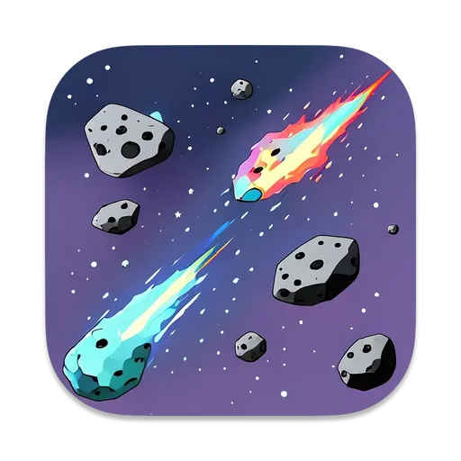

# Galaxy Wars

This was my second year project.

This is a fast-paced arcade game where you dodge and destroy asteroids to survive. Collect power-ups to boost your health and weapon enhancers to unleash double firepower. Score points by blasting asteroids—the smaller they are, the more points you earn. Lose all health and lives, and it’s GAME OVER!

## Download

## Development

1. Install [uv](https://docs.astral.sh/uv/).
2. Optional: `uv python install`
3. Run `uv sync --all-extras --dev` to install project dependencies.
4. Run in dev mode: `./scripts/dev.sh`. Run `chmod 700 ./scripts/dev.sh` if you get permission error.
4. Build executable file: `./scripts/build.sh`. Run `chmod 700 ./scripts/build.sh` if you get permission error.
